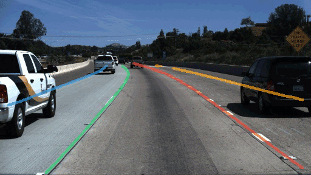

# Lane Detection: An Instance Segmentation Approach

## Introduction

This is a PyTorch implementation and variation of the paper [《Towards End-to-End Lane Detection: An Instance Segmentation Approach》](https://arxiv.org/abs/1802.05591).



## Basic Results

### Results on TuSimple Benchmark val
|Arch|Input Size|Accuracy|Details|
|-|-|-|-|
| | | | |

**Note:**
- Input size is 512*288

## Quick Start
### Preparation
1. Install dependencies:
    ```
    pip install -r requirements.txt
    ```

2. Download [TuSimple Benchmark](https://github.com/TuSimple/tusimple-benchmark/issues/3) dataset, and unzip the packs. The dataset structure should be as follows:
   ```
   tusimple_benchmark
    `-- |-- test_set
        |   |-- clips
        |   `-- ...
        `-- train_set
            |-- clips
            |-- label_data_xxxx.json
            |-- label_data_xxxx.json
            |-- label_data_xxxx.json
            `-- ...
   ```

### Training and Testing
#### Testing on TuSimple Benchmark
```shell
python test_lanenet-tusimple_benchmark.py \
        --data_dir /path/to/test_set \
        --arch <MODEL> \
        --ckpt_path /path/to/checkpoint/file
```
- Setup testing set path using `--data_dir /path/to/test_set`
- Select network architecture by `--arch <MODEL>`, options include `fcn`, `enet`, `icnet`, and `fcn` is the default option.
- Add `--dual_decoder` to use seperate decoders for the binary segmentation branch and embedding branch. By default, these two branches shares a decoder.
- Checkpoint file should be a `*.pth` file.
- Add `--show` to display output images while testing. In each iteration, after show images ,the program pauses until a key is pressed.
- Add `--save_img` to save images into `./output/` while testing.
- Add `--ipm` to conduct **Inverse Projective Mapping(IPM)** before fitting lane curves.
- By passing `--tag <string>`, one can record experimental settings notices in a string, which will be included in the name of output directories and log files.

#### Training on TuSimple Benchmark
```shell
python train_lanenet.py \
        --data_dir /path/to/train_set \
        --arch <MODEL> \
        --ckpt_path /path/to/checkpoint/file
```
- Setup training set path using `--data_dir /path/to/train_set`, both training and validation data are loaded from this directory.
- Select network architecture by `--arch <MODEL>`, options include `fcn`, `enet`, `icnet`, and `fcn` is the default option.
- Add `--dual_decoder` to use seperate decoders for the binary segmentation branch and embedding branch. By default, these two branches shares a decoder.
- Checkpoint file should be a `*.pth` file.
- By passing `--tag <string>`, one can record experimental settings notices in a string, which will be included in the name of output directories and log files.


## Dataset division and analysis

## Architecture

## Tensorboard Summary Details

## TODO
- integrate TuSimple Bencnmark eval script with the test script
- Discuss about IPM, dataset division.
